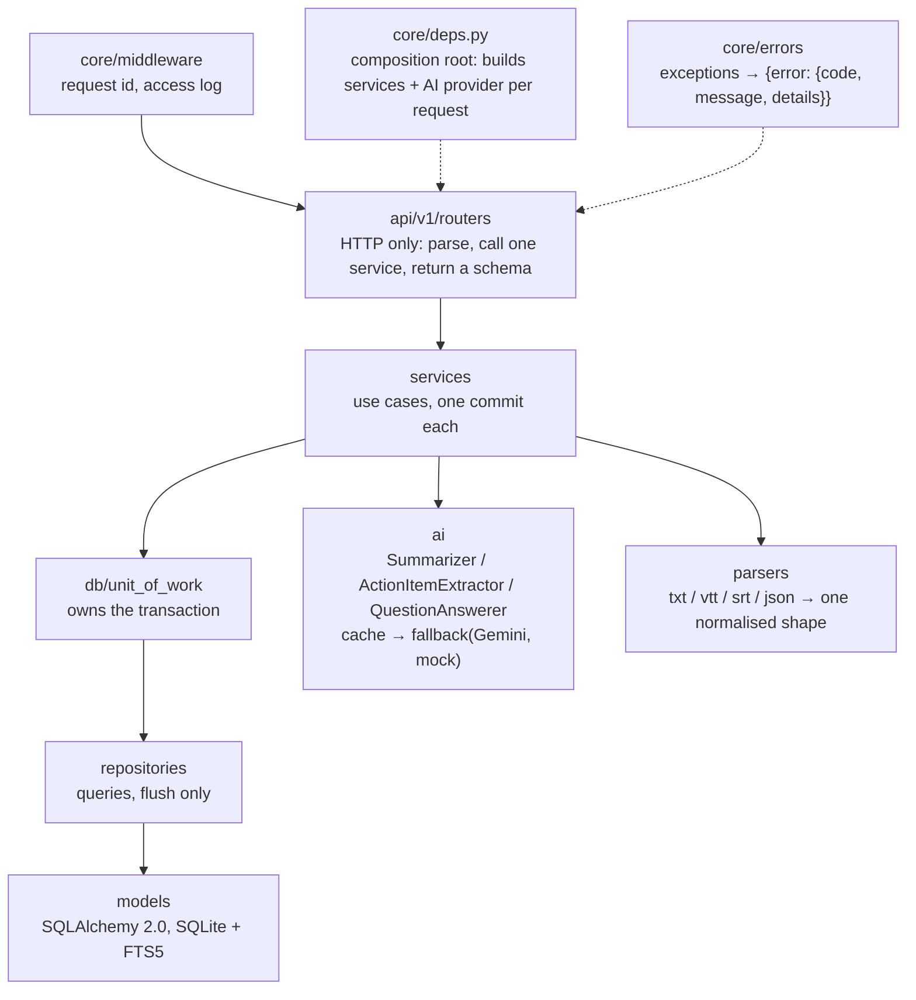

# Fireflies.ai Clone

A clone of [Fireflies.ai](https://fireflies.ai) — the AI meeting assistant — for meeting
transcripts, AI summaries, chapters and action items. It is a monorepo with a Next.js
(TypeScript) frontend in `frontend/` and a FastAPI + SQLite backend in `backend/`.

## Overview

Meetings come from seed data, an uploaded transcript file (`.txt`, `.vtt`, `.srt`, `.json`),
pasted text or a plain form; there is no speech-to-text. When a transcript is imported, an AI
provider writes an overview, an outline of chapters with timestamps, grouped notes, keywords and
action items. Users can browse and filter a meeting library, read a transcript next to a player
that seeks to any line, edit titles, participants, speaker names and transcript lines, manage
action items, organise meetings into channels, search every transcript, and soft-delete and
restore meetings. There is no login: one seeded demo user is always signed in.

**Status:** the backend API is complete for the features listed as done below. The frontend
currently ships the marketing landing page; the app screens (library, meeting detail, tasks,
and so on) are in progress.

## Live demo

| | URL |
|---|---|
| Frontend (Vercel) | https://fireflies-clone-rr8h.vercel.app |
| API health (PythonAnywhere) | https://aarushrajoura.pythonanywhere.com/api/health |
| Interactive API docs (Swagger) | https://aarushrajoura.pythonanywhere.com/docs |

Both run on free tiers, so the first request after a quiet period can take a few seconds.

## Features vs brief

Legend: **Done (API)** means the backend and its tests are finished and the endpoint is live;
**In progress** means the screen is not built yet.

| Brief item | Backend | Frontend |
|---|---|---|
| Library: title, date, duration, participants; search and filter by title, date, participant; sort by recency | Done (API): `GET /meetings` with `q`, `participant`, `date_from`/`date_to` (local days in `tz`), `tag`, `channel`, `scope`, `status`, `sort` | In progress |
| Meeting detail: transcript with speakers and timestamps, media player, click-to-seek | Done (API): transcript, speakers, `GET /meetings/{id}/media` with HTTP Range | In progress |
| In-transcript search with highlighted matches | Not needed: the client searches the full transcript from `GET /meetings/{id}/transcript` | In progress |
| AI summary, action items, outline / chapters, keywords | Done (API): generated on import, `POST .../summary/regenerate` | In progress |
| Create (upload, paste, form), edit title and participants, delete | Done (API): previews, create, patch, soft delete + restore | In progress |
| Add / edit / complete action items | Done (API) | In progress |
| Channels (Meetings hub sidebar) | Done (API): CRUD, meeting `channel_id` | In progress |
| Global search | Done (API): ranked FTS5 hits across all meetings | In progress |
| Upcoming meetings | Done (API): `status=upcoming` with join link and platform (simulated calendar) | In progress |
| Landing page | — | Done |
| Tags, comments, highlights, soundbites | Done (API): tag CRUD + `PUT /meetings/{id}/tags`, suggested tags on the detail; comments and highlights on transcript lines; 3-180 s soundbites | In progress |
| Ask AI about a meeting (and across meetings) | Done (API): `POST /meetings/{id}/ask` and `POST /search/ask`, cited transcript lines, rate limited | In progress |
| Export (PDF / Markdown / TXT) | Done (API): `GET /meetings/{id}/export?format=&sections=` | Planned |
| Dark mode | — | Planned (dark is the default theme) |
| Live bot, real STT, integrations, team sharing, real auth | Out of scope (placeholders) | Placeholders planned |

## Tech stack

**Backend**
- Python 3.12/3.13, FastAPI, Pydantic v2, pydantic-settings
- SQLAlchemy 2.0 and Alembic on SQLite (WAL, foreign keys on, FTS5 full-text search)
- AI: a deterministic offline mock provider, and Google Gemini (`gemini-3.5-flash` by default)
  with automatic fallback to the mock
- `slowapi`/`limits` for the AI rate limit
- `uv` for dependencies; `pytest`, `ruff` (lint + format), `mypy --strict`

**Frontend**
- Next.js 16 (App Router) with TypeScript (`strict`, `noUncheckedIndexedAccess`), React 19
- Tailwind CSS v3 on design tokens (`src/styles/tokens.css`), Radix UI primitives, `lucide-react` icons
- TanStack Query v5 for server state; `openapi-fetch` client typed by `openapi-typescript` from
  `docs/openapi.json`
- Vitest + Testing Library, ESLint (with import-boundary rules), Prettier

**Hosting and CI:** Vercel (frontend), PythonAnywhere (API + SQLite on its persistent disk),
GitHub Actions.

## Architecture

### Backend layers



- **Routers** translate HTTP only. **Services** hold the rules and receive a `UnitOfWork`, never
  an engine or a FastAPI object. **Repositories** hold every query and only flush; the
  `UnitOfWork` commits once per use case.
- **`core/deps.py` is the composition root**: the one module that wires a request's
  `UnitOfWork`, services and AI provider together, so it is allowed to import services and
  `app.ai`.
- **Layering is enforced:** `scripts/check_layering.py` (run in CI) fails if `app/api` imports
  models, db, repositories or SQLAlchemy, or if `app/services` imports FastAPI/Starlette.
- **AI runs outside write transactions** (SQLite has one writer). Regeneration uses a claim
  token so two concurrent regenerations cannot overwrite each other.
- **One error format:** domain exceptions carry no HTTP knowledge; `core/errors.py` is the single
  map to statuses and the `{"error": {"code", "message", "details"}}` envelope.
- `create_app(settings)` builds the app, so every test runs against its own migrated database.

### Frontend layers

The frontend mirrors the backend's layering:

| Backend | Frontend | Rule |
|---|---|---|
| `api/` routers | `app/**/page.tsx` | Compose features only; no fetching, no business logic |
| `services/` | `features/*/hooks/*` | Logic and data flow; call only the feature's `api.ts` |
| `repositories/` | `lib/api/client.ts` + `features/*/api.ts` | The only code that does HTTP, typed by the generated OpenAPI types |
| `schemas/` | `types/api.d.ts` (generated) + `lib/api/types.ts` (readable aliases) | Never hand-edit generated types (`make types`) |
| `core/deps.py` | `app/providers.tsx` | The only place app-wide singletons (query client, theme, toaster) are created |
| Protocols | `ApiClient`, each feature's `index.ts` | Swappable implementations behind small interfaces |
| `check_layering.py` | ESLint `no-restricted-imports` | Lint-enforced: no deep feature imports; `components/ui` never imports features; only `lib/api` and `features/*/api.ts` import the HTTP client; `app/**` (except the `providers.tsx` composition root) imports neither the client nor TanStack Query, so pages cannot fetch |

- **Same-origin API:** the browser only calls its own origin; `next.config.ts` rewrites `/api/*`
  to `BACKEND_URL`, so there is no CORS or cross-site cookie to manage. Media `Range` requests
  (206) and multipart uploads pass through the rewrite unchanged.
- **Proxy limits:** self-hosted `next dev`/`next start` proxies with
  `experimental.proxyTimeout` = 120 s (Next's default is 30 s, too short for an AI call on a
  cold backend). On Vercel, an external rewrite is proxied by Vercel's edge instead, and that
  setting does not apply. Vercel documents a 4.5 MB request-body limit for Functions and a
  time limit on proxied external requests; we have not confirmed the exact limits for
  external rewrites. Uploads are therefore kept small: transcripts are text, the backend caps
  files at 10 MB (`MAX_UPLOAD_MB`), and real transcripts are usually well under 1 MB. If Vercel's
  4.5 MB limit does apply to rewrites, a file between 4.5 MB and 10 MB would be rejected on the
  hosted demo but work locally. The fix would be to post that upload directly to the API origin,
  which already sends CORS headers.
- **One error path:** `unwrap()` turns the backend's error envelope (or a network failure) into a
  typed `ApiError`. Queries retry once, and only for network, 5xx and 429 (AI rate limit) errors.
  A failed mutation shows an error toast with **Retry** for the same retryable errors. A mutation
  can override this with `meta: { retryable }`, or skip the toast with `meta: { errorToast: false }`.
  The global Retry re-runs the mutation from the cache, so per-call `mutate(vars, { onSuccess })`
  callbacks do not run again. Features that depend on them show their own toast instead.
- **Query keys** come from one factory (`lib/api/query-keys.ts`), nested per meeting so a single
  invalidation covers a meeting's transcript, summary and action items.
- **Shell:** `features/shell` (icon rail, top bar, profile and capture menus, help button) wraps
  every page in the `(app)` route group; screens not built yet render a visible Coming Soon
  placeholder rather than a dead link.

Design decisions with their reasoning are in [docs/decisions.md](docs/decisions.md).

## Database schema

SQLite, created only by Alembic migrations (never `create_all()`). The full ER diagram and design
notes are in [docs/schema.md](docs/schema.md).

| Table | Holds |
|---|---|
| `users` | The demo user and the seeded cast |
| `meetings` | Title, start time, duration, host, channel, source, status, media, join link, soft delete |
| `participants` | People in a meeting (optionally a user), role, talk time |
| `speakers` | Diarised labels ("Speaker 1"), optionally identified as a participant |
| `transcript_segments` | One line each: speaker, `start_ms`/`end_ms`, text and original text |
| `transcript_fts` | FTS5 index over segment text, kept in sync by triggers |
| `summaries`, `summary_sections`, `keywords` | Overview + provenance, outline/notes sections, keywords |
| `action_items` | Text, assignee, due date, status, link to the moment in the transcript |
| `channels` | Meeting folders |
| `tags`, `meeting_tags` | Case-insensitive tag names and their meeting links |
| `comments`, `highlights`, `soundbites` | Notes on a meeting or a transcript line, character-range highlights, recording clips |

Times are UTC; recording positions and durations are integer milliseconds. Owned content
cascades on delete; optional references to people and channels are set to null.

## API overview

REST under `/api/v1` (health at `/api/health`). Lists share one page shape
(`{items, page, page_size, total, total_pages, has_next}`), every error uses the envelope
above with a declared status, and every DELETE returns `204`. AI-backed requests (regenerate,
ask, and create with a transcript) share a per-client rate limit.

| Area | Endpoints |
|---|---|
| Meetings | `GET POST /meetings` · `GET PATCH DELETE /meetings/{id}` · `POST /meetings/{id}/restore` |
| Transcript | `POST /transcript-previews` (+ `/files`) · `GET /meetings/{id}/transcript` · `PATCH /segments/{id}` · `PATCH /speakers/{id}` · `GET /meetings/{id}/media` |
| Summary & AI | `GET /meetings/{id}/summary` · `POST /meetings/{id}/summary/regenerate` · `POST /meetings/{id}/ask` · `POST /search/ask` |
| Action items | `GET POST /meetings/{id}/action-items` · `PATCH DELETE /action-items/{id}` |
| Tags | `GET POST /tags` · `PATCH DELETE /tags/{id}` · `PUT /meetings/{id}/tags` |
| Comments / highlights | `GET POST /meetings/{id}/comments` · `PATCH DELETE /comments/{id}` · same for `highlights` |
| Soundbites | `GET POST /meetings/{id}/soundbites` · `DELETE /soundbites/{id}` |
| Search & export | `GET /search?q=` · `GET /meetings/{id}/export?format=md\|txt\|pdf` |
| Channels & identity | `GET POST /channels` · `PATCH DELETE /channels/{id}` · `GET /me` · `GET /users` |

Conventions, the full endpoint table with declared errors, and worked examples are in [docs/api.md](docs/api.md); the machine-readable contract is
[docs/openapi.json](docs/openapi.json) (`make types`; a test fails if it drifts).

## Setup

Requirements: Python 3.12 or 3.13 with [uv](https://docs.astral.sh/uv/), Node.js 22, `make`.

**Backend** (from the repository root)

```bash
cd backend && uv sync && cd ..
cp .env.example backend/.env     # Settings reads backend/.env; defaults work as-is
make migrate                     # alembic upgrade head
make seed                        # demo meetings (+ generates the sample recording)
make dev-backend                 # http://localhost:8000/docs
```

**Frontend**

```bash
cd frontend
npm install
npm run dev                      # http://localhost:3000
```

Set `BACKEND_URL` in `frontend/.env.local` if the API is not on `http://localhost:8000`; the
Next.js `/api` rewrite proxies to it (on Vercel, set it before building).

**Useful targets:** `make seed-reset` (wipe and re-seed), `make seed-refresh` (move past
seeded upcoming meetings back into the future), `make types` (export OpenAPI and regenerate the
frontend client types),
`make requirements` (regenerate `backend/requirements.txt` for PythonAnywhere).

**Checks**

```bash
cd backend
uv run pytest -q
uv run ruff check && uv run ruff format --check
uv run mypy app
uv run python ../scripts/check_layering.py
```

`make test` and `make lint` run the backend and frontend checks together; CI runs all of the
above plus a check that `requirements.txt` matches `uv.lock`.

**Deploying the API** to a PythonAnywhere account: run `deploy/pythonanywhere/setup.sh` in a
PythonAnywhere Bash console (it installs, migrates, seeds if empty, refreshes upcoming meetings
and reloads the web app).

## Assumptions

- **Demo user only.** There is no authentication; the first seeded user is always the current
  user. Login and sign-up screens are placeholders.
- **Calendar and bot are simulated.** Upcoming meetings, join links and platforms come from seed
  data; nothing joins a real call, and transcripts never come from audio.
- **SQLite on PythonAnywhere's persistent disk.** The database file lives outside the repository
  (`~/fireflies-data/`), so data survives redeploys. One process serves the API, so the rate-limit
  counters are in memory.
- **Gemini is optional.** With `AI_PROVIDER=mock` (the default) or no API key, everything runs
  offline on the deterministic mock. With Gemini configured, any provider error falls back to
  the mock and the summary is labelled `mock (llm fallback)`.
- **Free hosting** means cold starts: the first request after idling can be slow.
- **The sample recording is a generated tone**, not speech. The seeder writes it (an 8 kHz WAV,
  at least as long as the longest seeded meeting with media) so the player and click-to-seek
  work end to end; it is not committed to the repository.
- Seed dates are relative to today (or to `SEED_ANCHOR_DATE` when set).

## What's next

1. App screens on the existing API: meetings library and hub, meeting detail with player and
   transcript, create/upload flow, tasks.
2. Screens for tags, comments, highlights and soundbites (the endpoints exist).
3. The "Ask AI" panels in a meeting and on the Meetings hub (the endpoints exist); then add
   conversation history to the ask contract.
4. The export modal (the endpoint exists).
5. Dark/light theme toggle, home dashboard, AskFred page, analytics, and the simulated team and
   integrations pages.
6. End-to-end tests (Playwright) and a demo GIF.
