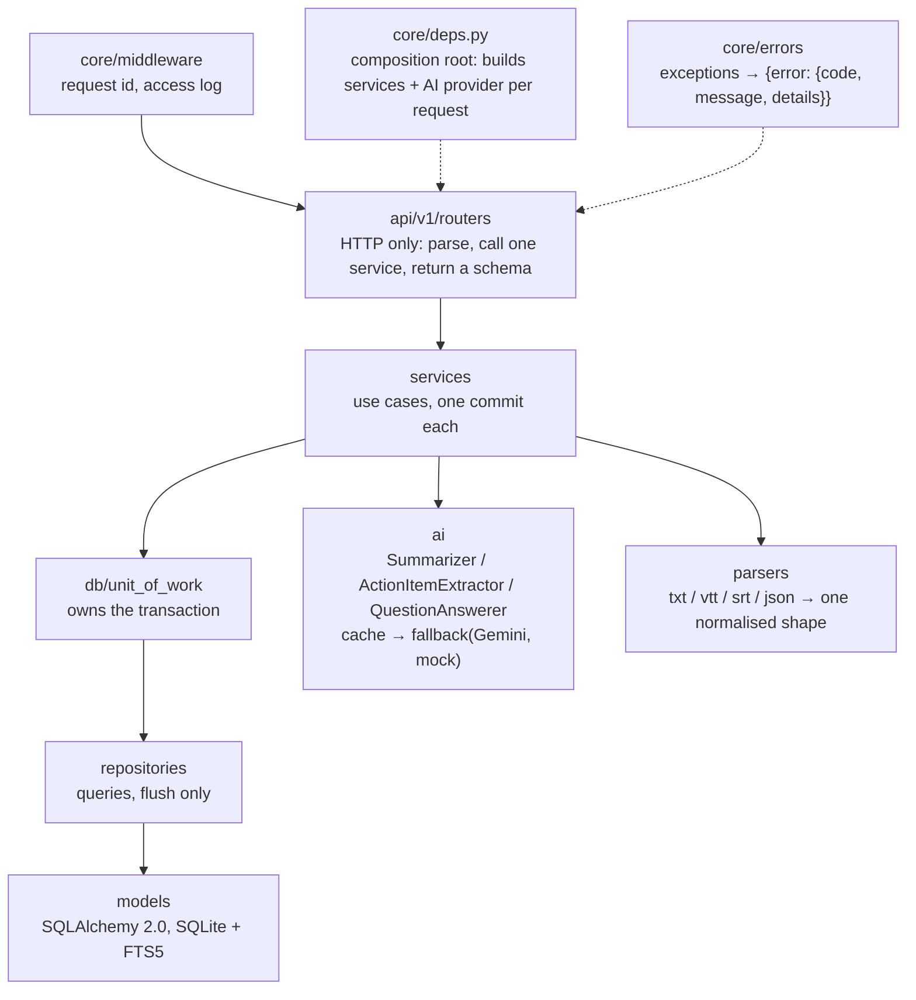

# Fireflies.ai Clone

A clone of [Fireflies.ai](https://fireflies.ai) — the AI meeting assistant — for meeting
transcripts, AI summaries, chapters and action items. It is a monorepo with a Next.js
(TypeScript) frontend in `frontend/` and a FastAPI + SQLite backend in `backend/`.

## Overview

Meetings come from seed data, an uploaded transcript file (`.txt`, `.vtt`, `.srt`, `.json`),
pasted text or a plain form; there is no speech-to-text. When a transcript is imported, an AI
provider writes an overview, an outline of chapters with timestamps, grouped notes, keywords and
action items. Users can browse and filter a meeting library, read a transcript next to a player
that seeks to any line, edit titles, participants, speaker names and transcript lines, manage
action items, organise meetings into channels, search every transcript, and soft-delete and
restore meetings. Around that sit a home dashboard, a cross-meeting task list, AskFred chats,
analytics, a simulated integrations catalogue and a simulated team. There is no login: one
seeded demo user is always signed in.

**Status:** the API (77 operations on 54 paths), the app screens and the marketing pages are
built. Tests: 542 backend (pytest) and 661 frontend (Vitest), all passing.

## Live demo

| | URL |
|---|---|
| Frontend (Vercel) | https://fireflies-clone-rr8h.vercel.app |
| API health (PythonAnywhere) | https://aarushrajoura.pythonanywhere.com/api/health |
| Interactive API docs (Swagger) | https://aarushrajoura.pythonanywhere.com/docs |

Both run on free tiers, so the first request after a quiet period can take a few seconds.

## Features vs brief

Legend: **Done** means the backend and the screen both exist. Pages are under
`frontend/src/app`.

| Brief item | Where it lives |
|---|---|
| Library: title, date, duration, participants; search and filter by title, date, participant; sort by recency | Done: `/meetings` hub, `GET /meetings` with `q`, `participant`, `date_from`/`date_to` (local days in `tz`), `tag`, `channel`, `scope`, `status`, `sort` |
| Meeting detail: transcript with speakers and timestamps, media player, click-to-seek | Done: `/meetings/[id]`, `GET /meetings/{id}/media` with HTTP Range |
| In-transcript search with highlighted matches | Done: the client searches the full transcript from `GET /meetings/{id}/transcript` |
| AI summary, action items, outline / chapters, keywords | Done: generated on import, `POST .../summary/regenerate`; the provider that wrote it is shown |
| Create (upload, paste, form), edit title and participants, delete | Done: previews, create, patch, soft delete + restore |
| Add / edit / complete action items | Done: per meeting, and in the cross-meeting `/tasks` list (also standalone tasks, due-day buckets in the viewer's time zone) |
| Channels (Meetings hub sidebar) | Done: CRUD, meeting `channel_id` |
| Global search | Done: `/search`, ranked FTS5 hits across all meetings |
| Upcoming meetings | Done: `status=upcoming` with join link and platform (simulated calendar) |
| Landing, pricing, enterprise, login, sign-up | Done as pages; login and sign-up are placeholders (no real auth) |
| Tags, comments, highlights, soundbites | Done: tag CRUD + `PUT /meetings/{id}/tags`, comments and highlights on transcript lines, 3-180 s soundbites |
| Ask AI about a meeting (and across meetings) | Done: `POST /meetings/{id}/ask`, `POST /search/ask`, and the `/askfred` page with saved chats, citations, `@meeting` context and `/` skills; rate limited |
| Home dashboard, feed, notifications, calendar | Done: `/home`; feed derived on read; simulated calendar connections |
| Analytics | Done: `/analytics` over `GET /analytics/overview` (`range`, `tz`) |
| Integrations | Done (simulated): `/integrations` catalogue, connect and disconnect only record the fact |
| Team sharing | Done (simulated): `/team`, invites with roles, `/join/[token]`; "Shared with me" includes active teammates' meetings |
| Onboarding and settings | Done: `/onboarding`, `/settings` (profile, usage) |
| Export (PDF / Markdown / TXT) | Done: `GET /meetings/{id}/export?format=&sections=` |
| Dark mode | Done: dark is the default, light and system are chosen in Settings or the profile menu |
| AI Apps page | Placeholder (Coming Soon) |
| Live bot, real STT, real auth, real email | Out of scope (simulated or placeholder) |

## Tech stack

**Backend**
- Python 3.12/3.13, FastAPI, Pydantic v2, pydantic-settings
- SQLAlchemy 2.0 and Alembic on SQLite (WAL, foreign keys on, FTS5 full-text search)
- AI: a deterministic offline mock provider, and Google Gemini (`gemini-3.5-flash` by default,
  `DEFAULT_GEMINI_MODEL` in `app/ai/llm.py`) with automatic fallback to the mock; answers
  say which provider wrote them
- `slowapi`/`limits` for the AI rate limit
- `uv` for dependencies; `pytest`, `ruff` (lint + format), `mypy --strict`

**Frontend**
- Next.js 16 (App Router) with TypeScript (`strict`, `noUncheckedIndexedAccess`), React 19
- Tailwind CSS v3 on design tokens (`src/styles/tokens.css`), Radix UI primitives, `lucide-react` icons
- TanStack Query v5 for server state; `openapi-fetch` client typed by `openapi-typescript` from
  `docs/openapi.json`
- Vitest + Testing Library, ESLint (with import-boundary rules), Prettier

**Hosting and CI:** Vercel (frontend), PythonAnywhere (API + SQLite on its persistent disk),
GitHub Actions.

## Architecture

### Backend layers



- **Routers** translate HTTP only. **Services** hold the rules and receive a `UnitOfWork`, never
  an engine or a FastAPI object. **Repositories** hold every query and only flush; the
  `UnitOfWork` commits once per use case.
- **`core/deps.py` is the composition root**: the one module that wires a request's
  `UnitOfWork`, services and AI provider together, so it is allowed to import services and
  `app.ai`.
- **Layering is enforced:** `scripts/check_layering.py` (run in CI) fails if `app/api` imports
  models, db, repositories or SQLAlchemy, or if `app/services` imports FastAPI/Starlette.
- **AI runs outside write transactions** (SQLite has one writer). Regeneration uses a claim
  token so two concurrent regenerations cannot overwrite each other.
- **One error format:** domain exceptions carry no HTTP knowledge; `core/errors.py` is the single
  map to statuses and the `{"error": {"code", "message", "details"}}` envelope.
- `create_app(settings)` builds the app, so every test runs against its own migrated database.

### Frontend layers

The frontend mirrors the backend's layering:

| Backend | Frontend | Rule |
|---|---|---|
| `api/` routers | `app/**/page.tsx` | Compose features only; no fetching, no business logic |
| `services/` | `features/*/hooks/*` | Logic and data flow; call only the feature's `api.ts` |
| `repositories/` | `lib/api/client.ts` + `features/*/api.ts` | The only code that does HTTP, typed by the generated OpenAPI types |
| `schemas/` | `types/api.d.ts` (generated) + `lib/api/types.ts` (readable aliases) | Never hand-edit generated types (`make types`) |
| `core/deps.py` | `app/providers.tsx` | The only place app-wide singletons (query client, theme, toaster) are created |
| Protocols | `ApiClient`, each feature's `index.ts` | Swappable implementations behind small interfaces |
| `check_layering.py` | ESLint `no-restricted-imports` | Lint-enforced: no deep feature imports; `components/ui` never imports features; only `lib/api` and `features/*/api.ts` import the HTTP client; `app/**` (except the `providers.tsx` composition root) imports neither the client nor TanStack Query, so pages cannot fetch |

- **Same-origin API:** the browser only calls its own origin; `next.config.ts` rewrites `/api/*`
  to `BACKEND_URL`, so there is no CORS or cross-site cookie to manage. Media `Range` requests
  (206) and multipart uploads pass through the rewrite unchanged.
- **Proxy limits:** self-hosted `next dev`/`next start` proxies with
  `experimental.proxyTimeout` = 120 s (Next's default is 30 s, too short for an AI call on a
  cold backend). On Vercel, an external rewrite is proxied by Vercel's edge instead, and that
  setting does not apply. Vercel documents a 4.5 MB request-body limit for Functions and a
  time limit on proxied external requests; we have not confirmed the exact limits for
  external rewrites. Uploads are therefore kept small: transcripts are text, the backend caps
  files at 10 MB (`MAX_UPLOAD_MB`), and real transcripts are usually well under 1 MB. If Vercel's
  4.5 MB limit does apply to rewrites, a file between 4.5 MB and 10 MB would be rejected on the
  hosted demo but work locally. The fix would be to post that upload directly to the API origin,
  which already sends CORS headers.
- **One error path:** `unwrap()` turns the backend's error envelope (or a network failure) into a
  typed `ApiError`. Queries retry once, and only for network, 5xx and 429 (AI rate limit) errors.
  A failed mutation shows an error toast with **Retry** for the same retryable errors. A mutation
  can override this with `meta: { retryable }`, or skip the toast with `meta: { errorToast: false }`.
  The global Retry re-runs the mutation from the cache, so per-call `mutate(vars, { onSuccess })`
  callbacks do not run again. Features that depend on them show their own toast instead.
- **Query keys** come from one factory (`lib/api/query-keys.ts`), nested per meeting so a single
  invalidation covers a meeting's transcript, summary and action items.
- **Shell:** `features/shell` (icon rail, top bar, profile and capture menus, help button) wraps
  every page in the `(app)` route group; screens not built yet render a visible Coming Soon
  placeholder rather than a dead link.

Design decisions with their reasoning are in [docs/decisions.md](docs/decisions.md).

## Database schema

SQLite, created only by Alembic migrations (never `create_all()`). The full ER diagram and design
notes are in [docs/schema.md](docs/schema.md).

| Table | Holds |
|---|---|
| `users` | The demo user and the seeded cast |
| `meetings` | Title, start time, duration, host, channel, source, status, media, join link, soft delete |
| `participants` | People in a meeting (optionally a user), role, talk time |
| `speakers` | Diarised labels ("Speaker 1"), optionally identified as a participant |
| `transcript_segments` | One line each: speaker, `start_ms`/`end_ms`, text and original text |
| `transcript_fts` | FTS5 index over segment text, kept in sync by triggers |
| `summaries`, `summary_sections`, `keywords` | Overview + provenance, outline/notes sections, keywords |
| `action_items` | Text, assignee, due date, status, link to the moment in the transcript; `meeting_id` is optional (standalone tasks) |
| `user_tools` | Tools the user named in onboarding |
| `calendar_connections`, `notifications` | Simulated calendar links; the bell's notifications |
| `integration_connections` | Which catalogue integrations the user "connected" (simulated) |
| `chat_threads`, `chat_messages`, `chat_citations` | Saved AskFred chats, their messages and cited transcript lines |
| `teams`, `team_members` | A team, and its seats (invited or active) with roles |
| `channels` | Meeting folders |
| `tags`, `meeting_tags` | Case-insensitive tag names and their meeting links |
| `comments`, `highlights`, `soundbites` | Notes on a meeting or a transcript line, character-range highlights, recording clips |

24 tables plus the `transcript_fts` virtual table, created by 8 linear migrations. Times are UTC; recording positions and durations are integer milliseconds. Owned content
cascades on delete; optional references to people and channels are set to null.

## API overview

REST under `/api/v1` (health at `/api/health`). Lists share one page shape
(`{items, page, page_size, total, total_pages, has_next}`), every error uses the envelope
above with a declared status, and every DELETE returns `204`. AI-backed requests (regenerate,
ask, AskFred messages, and create with a transcript) share a per-client rate limit.

| Area | Endpoints |
|---|---|
| Meetings | `GET POST /meetings` · `GET PATCH DELETE /meetings/{id}` · `POST /meetings/{id}/restore` |
| Transcript | `POST /transcript-previews` (+ `/files`) · `GET /meetings/{id}/transcript` · `PATCH /segments/{id}` · `PATCH /speakers/{id}` · `GET /meetings/{id}/media` |
| Summary & AI | `GET /meetings/{id}/summary` · `POST /meetings/{id}/summary/regenerate` · `POST /meetings/{id}/ask` · `POST /search/ask` |
| Action items | `GET POST /meetings/{id}/action-items` · `GET POST /action-items` (cross-meeting tasks) · `PATCH DELETE /action-items/{id}` |
| AskFred | `GET POST /chats` · `GET DELETE /chats/{id}` · `GET POST /chats/{id}/messages` · `GET /chat-skills` |
| Home | `GET /feed` · `GET /notifications` · `PATCH /notifications/{id}` · `POST /notifications/read-all` · `GET POST /calendar-connections` · `DELETE /calendar-connections/{provider}` |
| Analytics | `GET /analytics/overview?range=&tz=` |
| Integrations | `GET /integrations` · `GET /integrations/categories` · `PUT DELETE /integrations/{key}/connection` |
| Team | `GET /teams/me` · `POST /teams` · `PATCH /teams/{id}` · `POST /teams/{id}/members` · `PATCH DELETE /team-members/{id}` · `POST /team-invites/{token}/accept` |
| Tags | `GET POST /tags` · `PATCH DELETE /tags/{id}` · `PUT /meetings/{id}/tags` |
| Comments / highlights | `GET POST /meetings/{id}/comments` · `PATCH DELETE /comments/{id}` · same for `highlights` |
| Soundbites | `GET POST /meetings/{id}/soundbites` · `DELETE /soundbites/{id}` |
| Search & export | `GET /search?q=` · `GET /meetings/{id}/export?format=md\|txt\|pdf` |
| Channels & identity | `GET POST /channels` · `PATCH DELETE /channels/{id}` · `GET PATCH /me` · `PUT DELETE /me/onboarding` · `GET /me/usage` · `GET /users` |

Conventions, the full endpoint table with declared errors, and worked examples are in [docs/api.md](docs/api.md); the machine-readable contract is
[docs/openapi.json](docs/openapi.json) (`make types`; a test fails if it drifts).

## Setup

Requirements: Python 3.12 or 3.13 with [uv](https://docs.astral.sh/uv/), Node.js 22, `make`.

**Backend** (from the repository root)

```bash
cd backend && uv sync && cd ..
cp .env.example backend/.env     # Settings reads backend/.env; defaults work as-is
make migrate                     # alembic upgrade head (optional: the app also does it on startup)
make seed                        # demo meetings (+ generates the sample recording)
make dev-backend                 # http://localhost:8000/docs
```

**Frontend**

```bash
cd frontend
npm install
npm run dev                      # http://localhost:3000
```

Set `BACKEND_URL` in `frontend/.env.local` if the API is not on `http://localhost:8000`; the
Next.js `/api` rewrite proxies to it (on Vercel, set it before building).

**Settings** (`.env.example` lists them all): `DATABASE_URL`, `SQLITE_JOURNAL_MODE` (`wal`, or
`delete` on a network disk), `CORS_ORIGINS`, `AI_PROVIDER` (`mock` | `gemini`), `AI_API_KEY`,
`AI_MODEL` (blank = the built-in default), `AI_RATE_LIMIT`, `OUTBOUND_PROXY`, `MEDIA_DIR`,
`MAX_UPLOAD_MB`, `SEED_ANCHOR_DATE`, `LOG_LEVEL`, and `AUTO_MIGRATE` (default on: the app
migrates its database to the latest revision at startup). Set `AI_PROVIDER=gemini` plus
`AI_API_KEY` to use Gemini; the key belongs only in `backend/.env` or the host's environment.

**Useful targets:** `make seed-reset` (wipe and re-seed), `make seed-refresh` (move past
seeded upcoming meetings back into the future), `make types` (export OpenAPI and regenerate the
frontend client types),
`make requirements` (regenerate `backend/requirements.txt` for PythonAnywhere).

**Checks**

```bash
cd backend
uv run pytest -q
uv run ruff check && uv run ruff format --check
uv run mypy app
uv run python ../scripts/check_layering.py
```

`make test` and `make lint` run the backend and frontend checks together; CI runs all of the
above plus a check that `requirements.txt` matches `uv.lock`.

**Deploying the API** to a PythonAnywhere account: run `deploy/pythonanywhere/setup.sh` in a
PythonAnywhere Bash console. It installs, writes `backend/.env` on first run (SQLite journal mode
`delete`, `OUTBOUND_PROXY=http://proxy.server:3128`, which free accounts need to reach Gemini),
creates or reloads the web app, waits for it to answer (the web app migrates its own database on
startup), then seeds if empty and refreshes upcoming meetings. After a backend change, re-run it
to redeploy.

## Assumptions

- **Demo user only.** There is no authentication; the first seeded user is always the current
  user. Login and sign-up screens are placeholders.
- **Calendar, bot, integrations and team are simulated.** Upcoming meetings, join links and
  platforms come from seed data or the sample imports of a "connected" calendar; connecting an
  integration only records the fact; nothing joins a real call, and transcripts never come from
  audio.
- **Invites are simulated.** Inviting someone creates a link and a row; no email is sent. Opening
  `/join/[token]` accepts the invite as the demo user, with no authentication. A user can be on
  one team only.
- **Recap preference is stored only.** Onboarding saves "only my team" and similar recap
  choices, but nothing delivers a recap.
- **Retrying a failed first AskFred message** creates a second thread, because the first thread
  is only created when its first question succeeds.
- **SQLite on PythonAnywhere's persistent disk.** The database file lives outside the repository
  (`~/fireflies-data/`), so data survives redeploys. One process serves the API, so the rate-limit
  counters are in memory.
- **Gemini is optional.** With `AI_PROVIDER=mock` (the default) or no API key, everything runs
  offline on the deterministic mock. With Gemini configured, any provider error falls back to
  the mock and the answer is labelled `mock (llm fallback)`; summaries and chat answers show
  which provider wrote them. On PythonAnywhere's free tier the call goes through
  `OUTBOUND_PROXY`.
- **Free hosting** means cold starts: the first request after idling can be slow.
- **The sample recording is a generated tone**, not speech. The seeder writes it (an 8 kHz WAV,
  at least as long as the longest seeded meeting with media) so the player and click-to-seek
  work end to end; it is not committed to the repository.
- Seed dates are relative to today (or to `SEED_ANCHOR_DATE` when set).

## What's next

1. End-to-end tests (Playwright) and a demo GIF.
2. Recap delivery for the stored recap preference, and real invite emails.
3. Fix the duplicate thread when a failed first AskFred message is retried.
4. The AI Apps page (currently a placeholder).
5. Real authentication, calendars and integrations in place of the simulated ones.
