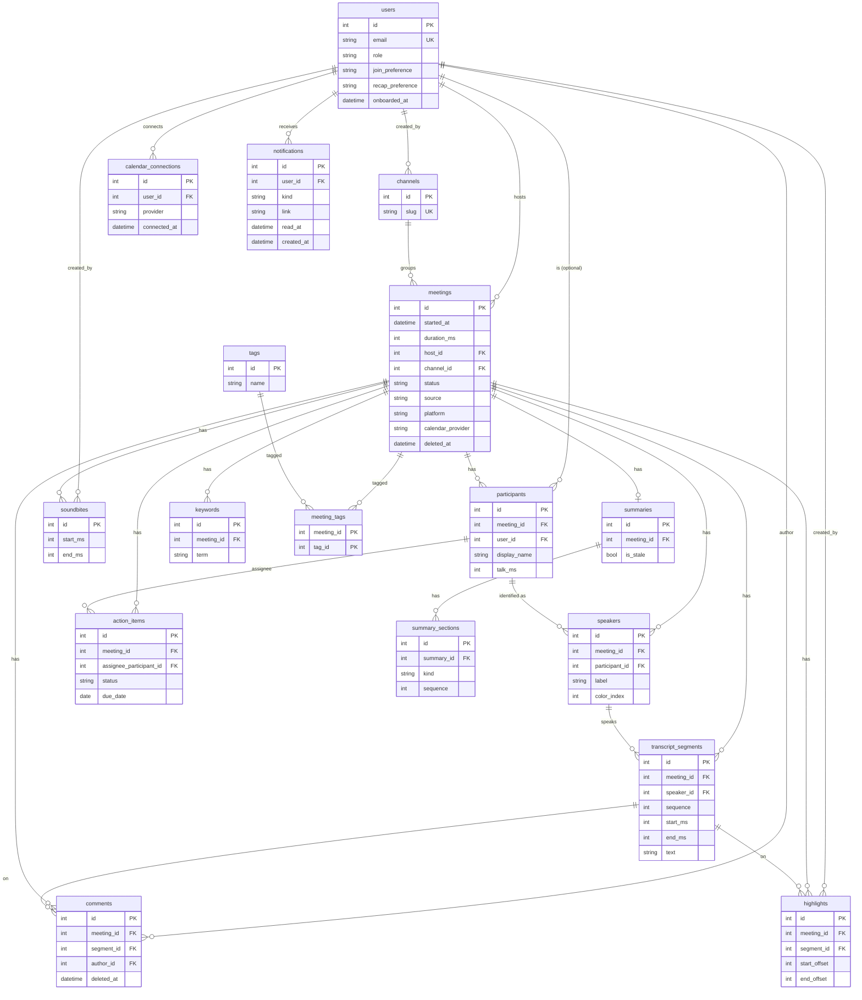

# Database schema

SQLite, created only by Alembic migrations (`backend/alembic/versions`). Models live in
`backend/app/models`, one module per aggregate.

`transcript_fts` is an FTS5 virtual table (external content over `transcript_segments`, rowid =
segment id), so it is not drawn as an ordinary table.

## Design decisions

- **Milliseconds as integers.** Every position or length in a recording (`start_ms`, `end_ms`,
  `duration_ms`, `talk_ms`) is an INTEGER, so there is no float drift or unit conversion.
  Wall-clock times are UTC. SQLite has no real timezone type and returns naive values, so
  every datetime column uses a `UTCDateTime` type: it rejects naive datetimes on write,
  converts aware ones to UTC, and returns aware UTC datetimes on read.
- **One home per content type.** Transcript text lives only in `transcript_segments`, summary
  prose only in `summaries` / `summary_sections`, keywords only in `keywords`, tasks only in
  `action_items`. Other tables point at them by id rather than copying their content.
- **Soft delete.** `meetings.deleted_at` and `comments.deleted_at` hide rows instead of removing
  them. Queries use `Meeting.not_deleted()`. Hard deletes (and the cascades below) only happen
  when a row is purged.
- **Denormalisations, all deliberate.**
  - `meetings.duration_ms`: set when the meeting is written, to the last transcript segment's
    `end_ms` (0 for a form meeting with no transcript); text edits never change it. Stored so
    lists and the `-duration_ms` sort need no segment scan.
  - `participants.talk_ms`: derivable from segments; stored so analytics needs no scan.
  - `action_items.completed_at`: redundant with `status = 'completed'`; records when.
  - `comments.meeting_id` and `highlights.meeting_id`: derivable via the segment; stored so
    per-meeting listing and the meeting cascade need no join.
- **Speakers indirection.** A transcript segment references a `speakers` row (a diarised label
  such as "Speaker 1"), and a speaker optionally maps to a `participants` row. Identifying a
  speaker is one update, and an unidentified voice still has a place.
- **Delete-rule policy.** Rows that make no sense without their meeting (or segment, summary,
  speaker) use `ON DELETE CASCADE`. Optional references to people (`participant_id`, `user_id`,
  `author_id`, `created_by`, `assignee_participant_id`) and `meetings.channel_id` use
  `SET NULL`, so removing a person or channel keeps the content. `meetings.host_id` is
  `RESTRICT`: a user who hosts meetings cannot be deleted. Foreign keys are enforced
  (`PRAGMA foreign_keys=ON` on every connection).
- **Constraints in the database.** Enums are VARCHAR with named CHECK constraints; time ranges,
  offsets and `color_index` have CHECKs; `(meeting_id, sequence)`, `(meeting_id, label)`,
  `(meeting_id, term)` and `(meeting_id, display_name)` are unique; tag names are unique
  case-insensitively through an index on `lower(name)`.
- **FTS joins back to meetings.** `transcript_fts` indexes only `transcript_segments.text`
  (porter stemming, unicode61). A hit's rowid is the segment id, so results join to
  `transcript_segments` and then to `meetings`, where `deleted_at` and other filters apply.
  Insert/update/delete triggers keep it in sync. A future migration that recreates
  `transcript_segments` must re-create those triggers.

- **Simulated calendar imports.** `calendar_connections` is unique per `(user_id, provider)`.
  Meetings a connection imports carry `meetings.calendar_provider`, so disconnecting
  soft-deletes exactly those. That column has no CHECK constraint (the ORM validates it):
  SQLite cannot drop a column named in one, and rebuilding `meetings` would lose its other
  CHECKs, so the migration adds and drops it in place.
- **Notifications.** `(user_id, read_at)` is indexed for the unread-first list and the bell's
  unread dot. Rows are written after the action they report has committed.

## Invariants enforced in the service layer

Composite foreign keys are not used, so the database does not stop a row pointing at another
meeting's data. Services must check each of these on write:

- `transcript_segments.speaker_id` refers to a speaker of the same `meeting_id`.
- `speakers.participant_id` refers to a participant of the same `meeting_id`.
- `action_items.assignee_participant_id` refers to a participant of the same `meeting_id`.
- `comments` and `highlights`: `(meeting_id, segment_id)` must match the segment's meeting
  (`422 SEGMENT_NOT_IN_MEETING`).
- `highlights`: offsets are UTF-16 code units (JavaScript string indices), and `end_offset` is
  at most the text's UTF-16 length when the highlight is written. Editing the
  segment text later does not move or trim highlights, so a client clamps ranges to the text.
- `highlights.color` is one of `yellow|green|blue|pink|purple` (checked by the request schema,
  not the database).
- `soundbites`: `3 s <= end_ms - start_ms <= 180 s` and `end_ms <= meetings.duration_ms`.
